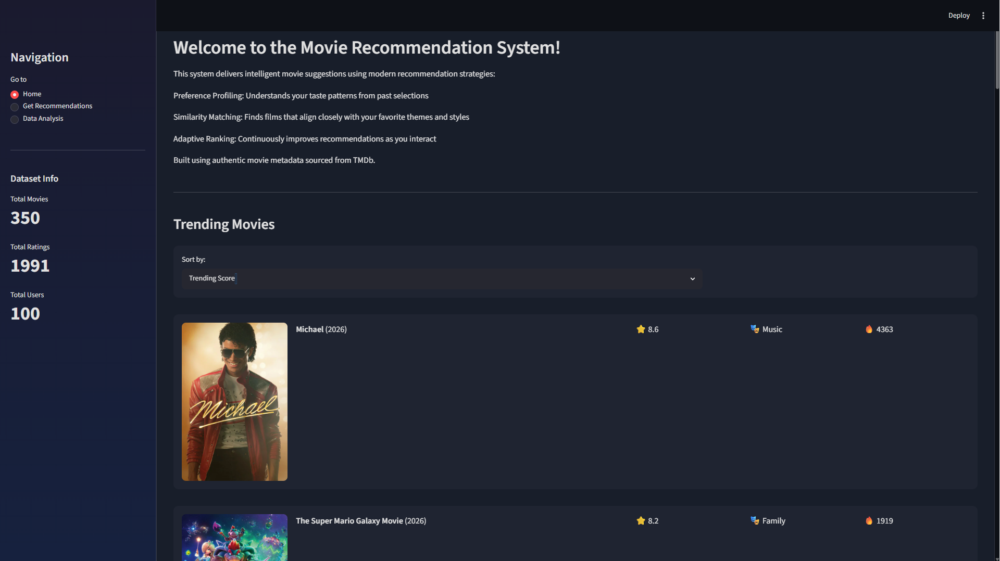
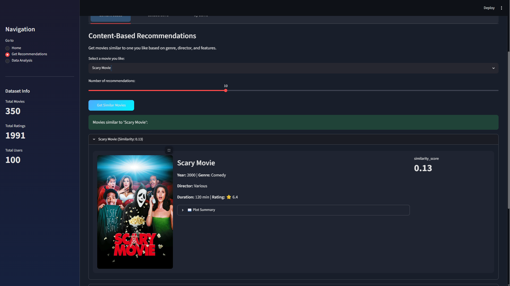
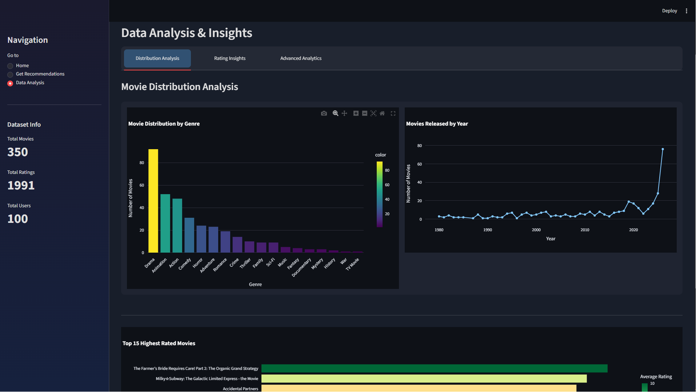

# Movie Recommendation System

A content-based movie recommendation system built with Python and Streamlit that suggests similar movies based on their metadata and features. The application integrates with the TMDB API to display movie posters, ratings, and additional details while providing an interactive and user-friendly interface.

## Features

- Content-based movie recommendations
- Interactive web interface built with Streamlit
- TMDB API integration for movie posters and metadata
- Search and discover similar movies
- Visualizations and analytics using Plotly and Matplotlib
- Fast recommendation generation using preprocessed data

## Tech Stack

- Python
- Streamlit
- Pandas
- NumPy
- Scikit-learn
- Plotly
- Matplotlib
- TMDB API

## Project Structure

```
.
├── app.py
├── lib/
│   ├── movie_recommender.py
│   ├── tmdb_api.py
│   └── visualizations.py
├── assets/
├── requirements.txt
└── README.md
```

## Installation

Clone the repository:

```bash
git clone https://github.com/your-username/movie-recommendation-system.git
cd movie-recommendation-system
```

Create and activate a virtual environment:

```bash
python -m venv venv
```

Install dependencies:

```bash
pip install -r requirements.txt
```

Create a `.env` file and add your TMDB API key:

```env
TMDB_API_KEY=your_api_key_here
```

Run the application:

```bash
streamlit run app.py
```

## Screenshots

### Home Page



### Recommendation Results



### Analytics Dashboard



## Future Improvements

- Hybrid recommendation model
- User authentication and personalized recommendations
- Collaborative filtering support
- Watchlist and favorites functionality
- Deployment to a cloud platform

## License

This project is intended for educational and portfolio purposes.